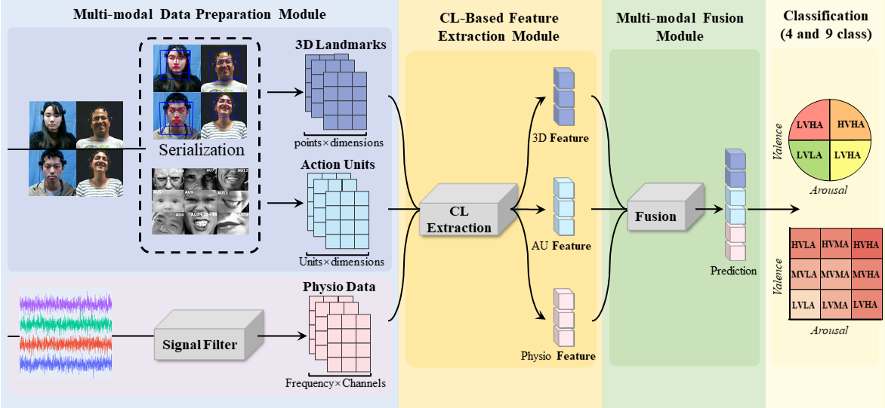

# CLMER


## Abstract

Emotion recognition plays a crucial role in human-computer interaction and affective computing. However, existing methods often struggle with effectively integrating heterogeneous modalities, such as physiological signals and visual data, due to their structural differences. In this paper, we propose CLMER, a contrastive learning-based multi-modal cross-attention framework designed to address the challenges of complex emotion recognition. The framework introduces a serialization strategy that transforms visual data into a time-series format, aligning it with the temporal characteristics of physiological signals. CLMER consists of three core components that work together to enable effective multi-modal emotion recognition. The multi-modal data preparation module preprocesses physiological and visual data, ensuring consistency across modalities. Building on this foundation, the contrastive learning based feature extraction module enhances temporal representations through self-supervised learning, capturing essential patterns within the data. Finally, the multi-modal fusion module employs cross-modal attention to integrate features seamlessly. Experimental evaluations on two public datasets DEAP, AMIGOS and an private dataset MAN-II demonstrate that CLMER significantly outperforms unimodal and traditional fusion approaches, achieving state-of-the-art performance in emotion classification tasks. These findings highlight the framework’s robust generalization ability, computational efficiency, and effectiveness in multi-modal emotion recognition, making it a promising approach for real-world applications.

## Requirements

- Python 3.8
- For dependencies, see [requirements.txt](./requirements.txt)


## Reference

<!-- ```
@article{wang2025milmer,
  title={Milmer: a Framework for Multiple Instance Learning based Multimodal Emotion Recognition},
  author={Wang, Zaitian and He, Jian and Liang, Yu and Hu, Xiyuan and Peng, Tianhao and Wang, Kaixin and Wang, Jiakai and Zhang, Chenlong and Zhang, Weili and Niu, Shuang and others},
  journal={arXiv preprint arXiv:2502.00547},
  year={2025}
}
``` -->
