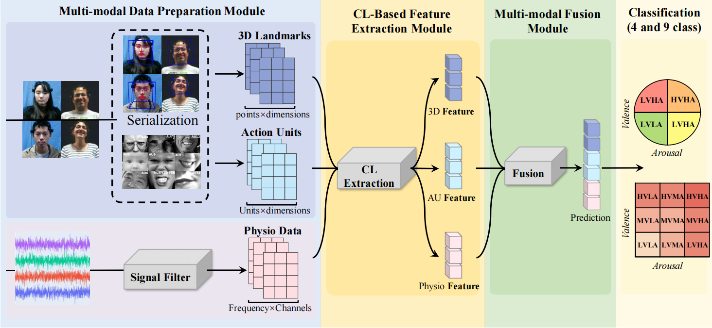

# CLMER
This is an implementation of the CLMER model, described in the following paper:

**CLMER: a Framework for Contrastive Learning-based Multi-modal Emotion Recognition**



## Abstract

Emotion recognition plays a crucial role in human-computer interaction and affective computing, yet its effectiveness is limited by the difficulty of integrating heterogeneous modalities with fundamentally different structures, such as physiological signals and visual data. In this paper, we propose CLMER, a contrastive learning-based multi-modal cross-attention frame-work designed to address the challenges of complex emotion recognition. The framework introduces a serialization strategy that converts pixel-level image data into time-series data, aligning it with the temporal characteristics of physiological signals.CLMER consists of three core components that work together to enable effective multi-modal emotion recognition. The multi-modal data preparation module preprocesses physiological and visual data, ensuring consistency across modalities. Building on this foundation, the contrastive learning-based feature extraction module generates temporal representations that capture the essential patterns embedded in the data through self-supervised learning. Finally, the multi-modal fusion module employs cross-modal attention to integrate features with improved modality alignment. Experimental evaluations on two public datasets DEAP, AMIGOS and a private dataset MAN-II demonstrate that CLMER significantly outperforms unimodal and traditional fusion approaches, achieving state-of-the-art performance in emotion classification tasks. These findings highlight the frame-work’s robust generalization, computational efficiency, and strong performance in multi-modal emotion recognition, suggesting its potential for real-world deployment.

## CLMER has two training phase
- "clmain.py": feature extraction module. This module leverages the self-supervised Contrastive Learning (CL) methods specifically designed for processing time-series data.
- "fmain.py": employ an established cross-modal attention mechanism to integrate the extracted representation.

## Reference
```
coming soon, accepted by IEEE Transactions on Neural Networks and Learning Systems (TNNLS).
```